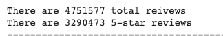
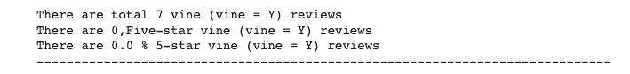
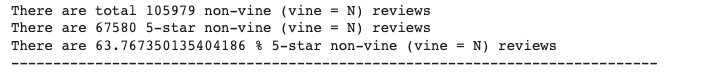

# Amazon_Vine_Analysis

##  Overview of Project

The purpose of this project is analyze Amazon reviews written by members of the paid Amazon Vine program. The Amazon Vine program is a service that allows manufacturers and publishers to receive reviews for their products. Companies like SellBy pay a small fee to Amazon and provide products to Amazon Vine members, who are then required to publish a review.

## Results of Vine reviews and non-Vine reviews

### Total number of reviews and Total number of 5-star reviews

  

### Vine reviews Results

  

Non-Vine reviews Results

  

## Sumary

* Our dataset is for Music and there is zero paid 5 start reviews. It seems like companies don't pay for gift card reviews.  
* On the contrary the Unpaid reviews has 87% positive reviews. So even unpaid reviews are also very positive.

We could perform the similar analysis for next best rating - (rating 4) and see if there is any bias since it's hard to detremine bias as there is not enough data to conclude paid reviews.
